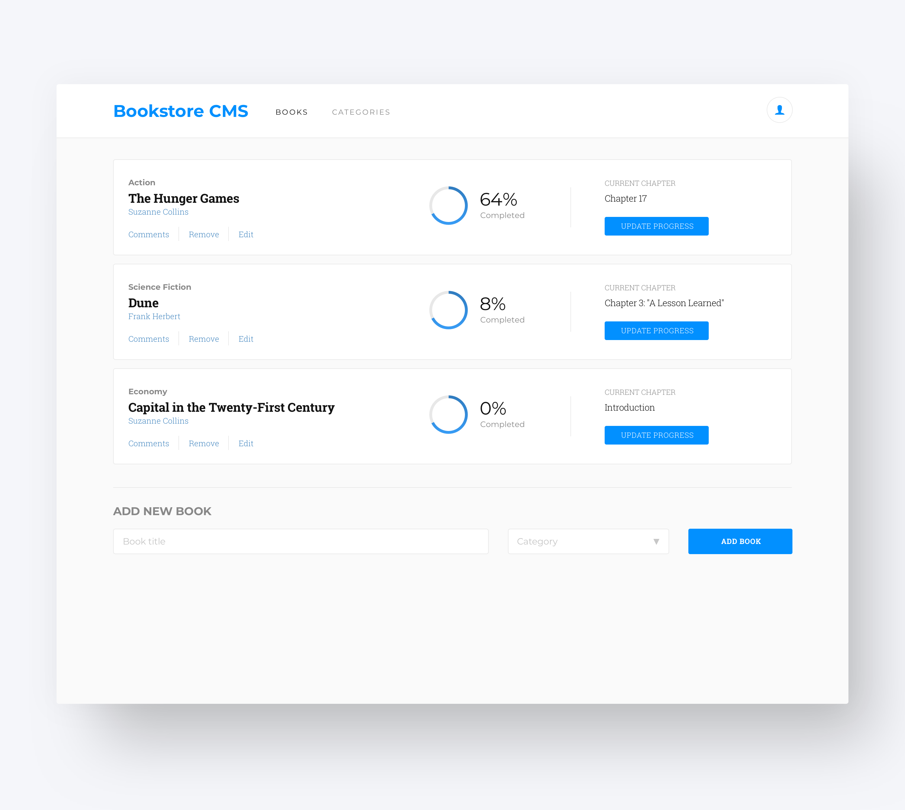

# REACT & REDUX BOOK-STORE

> In this project we will use React and Redux to build a very simple Bookstore. It will be deployed at Heroku.

<p align="center">
    <a href="https://img.shields.io/badge/Microverse-blueviolet" alt="Contributors">
        </a>
    <a href="https://www.javascript.com/" alt="JS">
        </a>
    <a href="https://webpack.js.org//" alt="Webpack">
        </a>
    <a href="https://eslint.org/" alt="Eslint">
        </a>
    <a href="https://stylelint.io/" alt="Stylelint">
        </a>
</p>

<p align="center">
    <br />
    <br />&#10023;
    <a href="#Prerequisites">Watch the Live Version</a> &#10023;
    <a href="#Prerequisites">Prerequisites</a> &#10023;
    <a href="#Getting-Started">Getting Started</a> &#10023;
    <a href="#Contributing">Contributing</a> &#10023;
    <a href="#Author">Author</a> &#10023;
    <a href="#Show-your-support">Show your support</a> &#10023;
    <a href="#License">License</a> &#10023;
    <a href="#Acknowledgments">Acknowledgments</a> &#10023;
    <a href="https://github.com/maosan132/Magic-bookstore/issues">Report Bug</a>&#10023;

</p>

<br/>

<b>Magic Bookstore</b> is a React and Redux simple Bookstore. It will be deployed at Heroku.


## Watch the Live Version

[Live Demo](https://mmash-agic-bookstore.herokuapp.com/)



### Prerequisites

- JavaScript ES6
- React
- React-Redux
- Redux
- NodeJS
- Webpack
- Buildpack
- Heroku


## Getting Started

In order to run locally this project type the following commands over the terminal in Linux or Mac or the Windows cmd console:

```s
$ git clone git@github.com:maosan132/Magic-bookstore.git
$ cd magic-bookstore
$ npm i
$ npm start

```

Open `http://localhost:3000` to view running project in the browser.

> Run the unit tests with
```s
$ npm run test
```
## Contributing

This project was created for educational purposes as part of the Microverse web development curriculum; contributing is not accepted.

Feel free to check the [issues page](https://github.com/maosan132/Magic-bookstore/issues).

## Author

👤 **Mauricio Santos**

- Github: [@maosan132](https://github.com/maosan132)
- Twitter: [@maosan132](https://twitter.com/maosan132)
- Linkedin: [maurisantos](https://www.linkedin.com/in/mauricsantos)


### Show your support

Give a ⭐️ if you like this project!

## License


This project is licensed under the MIT License